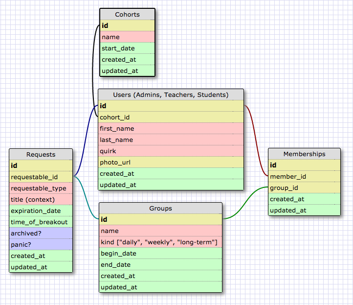

```xml
<?xml version="1.0" encoding="utf-8" ?>
<!-- SQL XML created by WWW SQL Designer, http://code.google.com/p/wwwsqldesigner/ -->
<!-- Active URL: https://socrates.devbootcamp.com/sql -->
<sql>
<datatypes db="mysql">
  <group label="Numeric" color="rgb(238,238,170)">
    <type label="Integer" length="0" sql="INTEGER" re="INT" quote=""/>
    <type label="Decimal" length="1" sql="DECIMAL" re="DEC" quote=""/>
    <type label="Single precision" length="0" sql="FLOAT" quote=""/>
    <type label="Double precision" length="0" sql="DOUBLE" re="DOUBLE" quote=""/>
  </group>

  <group label="Character" color="rgb(255,200,200)">
    <type label="Char" length="1" sql="CHAR" quote="'"/>
    <type label="Varchar" length="1" sql="VARCHAR" quote="'"/>
    <type label="Text" length="0" sql="MEDIUMTEXT" re="TEXT" quote="'"/>
    <type label="Binary" length="1" sql="BINARY" quote="'"/>
    <type label="Varbinary" length="1" sql="VARBINARY" quote="'"/>
    <type label="BLOB" length="0" sql="BLOB" re="BLOB" quote="'"/>
  </group>

  <group label="Date &amp; Time" color="rgb(200,255,200)">
    <type label="Date" length="0" sql="DATE" quote="'"/>
    <type label="Time" length="0" sql="TIME" quote="'"/>
    <type label="Datetime" length="0" sql="DATETIME" quote="'"/>
    <type label="Year" length="0" sql="YEAR" quote=""/>
    <type label="Timestamp" length="0" sql="TIMESTAMP" quote="'"/>
  </group>

  <group label="Miscellaneous" color="rgb(200,200,255)">
    <type label="ENUM" length="1" sql="ENUM" quote=""/>
    <type label="SET" length="1" sql="SET" quote=""/>
    <type label="Bit" length="0" sql="bit" quote=""/>
  </group>
</datatypes><table x="255" y="90" name="Users (Admins, Teachers, Students)">
<row name="id" null="1" autoincrement="1">
<datatype>INTEGER</datatype>
<default>NULL</default></row>
<row name="cohort_id" null="1" autoincrement="0">
<datatype>INTEGER</datatype>
<default>NULL</default><relation table="Cohorts" row="id" />
</row>
<row name="first_name" null="1" autoincrement="0">
<datatype>CHAR</datatype>
<default>NULL</default></row>
<row name="last_name" null="1" autoincrement="0">
<datatype>CHAR</datatype>
<default>NULL</default></row>
<row name="quirk" null="1" autoincrement="0">
<datatype>CHAR</datatype>
<default>NULL</default></row>
<row name="photo_url" null="1" autoincrement="0">
<datatype>INTEGER</datatype>
<default>NULL</default></row>
<row name="created_at" null="1" autoincrement="0">
<datatype>DATETIME</datatype>
<default>NULL</default></row>
<row name="updated_at" null="1" autoincrement="0">
<datatype>DATETIME</datatype>
<default>NULL</default></row>
<key type="PRIMARY" name="">
<part>id</part>
</key>
</table>
<table x="690" y="90" name="Memberships">
<row name="id" null="1" autoincrement="1">
<datatype>INTEGER</datatype>
<default>NULL</default></row>
<row name="member_id" null="1" autoincrement="0">
<datatype>INTEGER</datatype>
<default>NULL</default><relation table="Users (Admins, Teachers, Students)" row="id" />
</row>
<row name="group_id" null="1" autoincrement="0">
<datatype>INTEGER</datatype>
<default>NULL</default><relation table="Groups" row="id" />
</row>
<row name="created_at" null="1" autoincrement="0">
<datatype>DATETIME</datatype>
<default>NULL</default></row>
<row name="updated_at" null="1" autoincrement="0">
<datatype>DATETIME</datatype>
<default>NULL</default></row>
<key type="PRIMARY" name="">
<part>id</part>
</key>
</table>
<table x="228" y="370" name="Cohorts">
<row name="id" null="1" autoincrement="1">
<datatype>INTEGER</datatype>
<default>NULL</default></row>
<row name="name" null="1" autoincrement="0">
<datatype>CHAR</datatype>
<default>NULL</default></row>
<row name="start_date" null="1" autoincrement="0">
<datatype>DATE</datatype>
<default>NULL</default></row>
<row name="created_at" null="1" autoincrement="0">
<datatype>DATETIME</datatype>
<default>NULL</default></row>
<row name="updated_at" null="1" autoincrement="0">
<datatype>DATETIME</datatype>
<default>NULL</default></row>
<key type="PRIMARY" name="">
<part>id</part>
</key>
</table>
<table x="984" y="91" name="Groups">
<row name="id" null="1" autoincrement="1">
<datatype>INTEGER</datatype>
<default>NULL</default></row>
<row name="name" null="1" autoincrement="0">
<datatype>CHAR</datatype>
<default>NULL</default></row>
<row name="kind [&quot;daily&quot;, &quot;weekly&quot;, &quot;long-term&quot;]" null="1" autoincrement="0">
<datatype>CHAR</datatype>
<default>NULL</default></row>
<row name="begin_date" null="1" autoincrement="0">
<datatype>DATETIME</datatype>
<default>NULL</default></row>
<row name="end_date" null="1" autoincrement="0">
<datatype>DATETIME</datatype>
<default>NULL</default></row>
<row name="created_at" null="1" autoincrement="0">
<datatype>DATETIME</datatype>
<default>NULL</default></row>
<row name="updated_at" null="1" autoincrement="0">
<datatype>DATE</datatype>
<default>NULL</default></row>
<key type="PRIMARY" name="">
<part>id</part>
</key>
</table>
<table x="711" y="450" name="Requests">
<row name="id" null="1" autoincrement="1">
<datatype>INTEGER</datatype>
<default>NULL</default></row>
<row name="requestable_id" null="1" autoincrement="0">
<datatype>INTEGER</datatype>
<default>NULL</default><relation table="Users (Admins, Teachers, Students)" row="id" />
<relation table="Groups" row="id" />
</row>
<row name="requestable_type" null="1" autoincrement="0">
<datatype>VARCHAR</datatype>
<default>NULL</default></row>
<row name="title (context)" null="1" autoincrement="0">
<datatype>MEDIUMTEXT</datatype>
<default>NULL</default></row>
<row name="expiration_date" null="1" autoincrement="0">
<datatype>DATETIME</datatype>
<default>NULL</default></row>
<row name="time_of_breakout" null="1" autoincrement="0">
<datatype>TIME</datatype>
<default>NULL</default></row>
<row name="archived?" null="1" autoincrement="0">
<datatype>bit</datatype>
<default>NULL</default></row>
<row name="panic?" null="1" autoincrement="0">
<datatype>bit</datatype>
<default>NULL</default></row>
<row name="created_at" null="1" autoincrement="0">
<datatype>DATETIME</datatype>
<default>NULL</default></row>
<row name="updated_at" null="1" autoincrement="0">
<datatype>TIMESTAMP</datatype>
<default>NULL</default></row>
<key type="PRIMARY" name="">
<part>id</part>
</key>
</table>
</sql>
```
